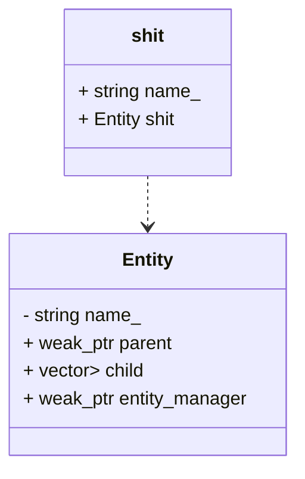

# 超级坑

他妈的能不能好好解决几个link问题啊大傻逼（单指作者自己）\
原来我才是傻逼！

```mermaid
classDiagram
    shit ..> Entity
    class Entity {
        - string name_
        + weak_ptr<Entity> parent
        + vector<shared_ptr<Entity>> child
        + weak_ptr<EntityManager> entity_manager
    }

    class shit {
        + string name_
        + Entity shit
    }
```
## 关于骨骼动画
骨骼动画我们使用点和权重相结合的方式。
其中点记录了影响这个点的骨骼编号，权重用一个浮点数表示。
在引擎中，一个顶点只支持使用4个骨骼影响。
