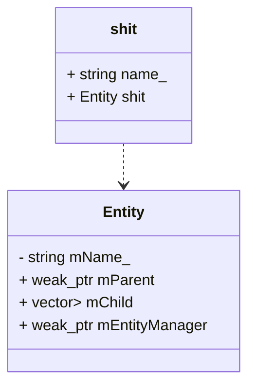

# 超级坑

他妈的能不能好好解决几个link问题啊大傻逼（单指作者自己）\
原来我才是傻逼！

```mermaid
classDiagram
    shit ..> Entity
    class Entity {
        - string mName_
        + weak_ptr<Entity> mParent
        + vector<shared_ptr<Entity>> mChild
        + weak_ptr<EntityManager> mEntityManager
    }

    class shit {
        + string name_
        + Entity shit
    }
```
