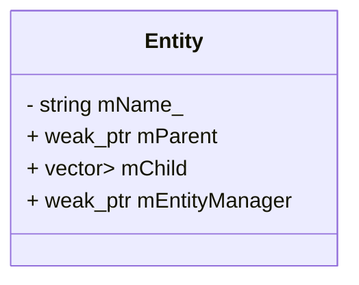

# 超级坑

他妈的能不能好好解决几个link问题啊大傻逼（单指作者自己）

```mermaid
classDiagram
class Entity{
	- string mName_
	+ weak_ptr<Entity> mParent
	+ vector<shared_ptr<Entity>> mChild
	+ weak_ptr<EntityManager> mEntityManager
}

```
